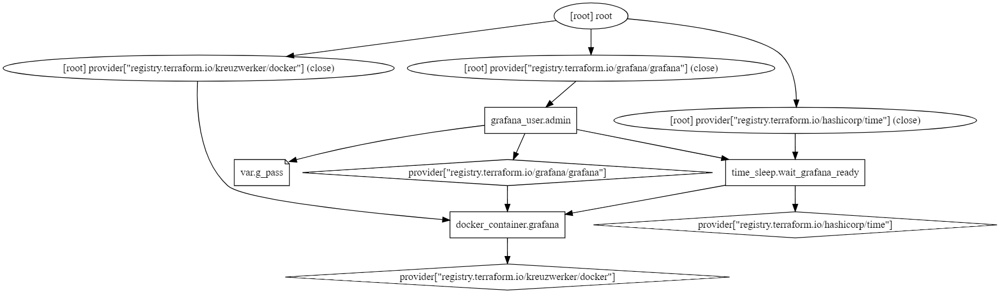

# Grafana Terraform Configuration

This project uses Terraform to deploy and configure a Grafana container along with an admin user.

## Project Structure



The graph above illustrates the structure and dependencies of our Terraform configuration.

## Files

- `main.tf` (contains the main Terraform configuration)
- `variables.tf` (contains variable definitions)

## Description

This Terraform configuration does the following:

1. Deploys a Grafana container using Docker
2. Waits for the Grafana container to be ready
3. Creates an admin user in Grafana

## Requirements

- Terraform installed (version compatible with the providers below)
- Docker installed and running

## Terraform Configuration
```hcl
terraform {
  required_providers {
    grafana = {
      source  = "grafana/grafana"
      version = "~> 3.7"
    }
    docker = {
      source  = "kreuzwerker/docker"
      version = "~> 3.0"
    }
  }
}
```

## Provider Configuration

### Docker Provider

```hcl
provider "docker" {}
```

### Grafana Provider

```hcl
provider "grafana" {
  url  = "http://localhost:${docker_container.grafana.ports[0].external}/"
  auth = "admin:admin"
}
```

Note: The Grafana provider uses the default admin credentials. It's recommended to change these credentials after the initial setup.

## Resources

1. Docker Container:
   ```hcl
   resource "docker_container" "grafana" {
     name  = "grafana_team_a"
     image = "grafana/grafana"
     ports {
       internal = 3000
       external = 3000
     }
   }
   ```

2. Time Sleep (for ensuring Grafana readiness):
   ```hcl
   resource "time_sleep" "wait_grafana_ready" {
     create_duration = "10s"
     depends_on      = [docker_container.grafana]
   }
   ```

3. Grafana Admin User:
   ```hcl
   resource "grafana_user" "admin" {
     login    = "lzadmin"
     email    = "lzadmin@localhost"
     password = var.g_pass
     is_admin = true
     depends_on = [docker_container.grafana,
       time_sleep.wait_grafana_ready,
     ]
     lifecycle {
       ignore_changes = [ 
           email, 
           password,
        ]
        prevent_destroy = false
     }
   }
   ```

## Variables

The following variable is defined in `variables.tf`:

```hcl
variable "g_pass" {
  type        = string
  description = "Grafana Password"
}
```

## Usage

1. Clone this repository:
   ```
   git clone git@github.com:NajmeM/Terraform.git
   cd Terraform-Grafana-Docker
   ```

2. Initialize Terraform:
   ```
   terraform init
   ```

3. Set the Grafana admin password:
   ```
   export TF_VAR_g_pass="your_secure_password"
   ```

4. Apply the Terraform configuration:
   ```
   terraform apply
   ```

5. When prompted, review the planned changes and type `yes` to proceed.

## Notes

- The Grafana container exposes port 3000 both internally and externally.
- There's a 10-second wait time after creating the container to ensure Grafana is ready before creating the user.
- The admin user's email and password are set to ignore changes in future applies.
- The `prevent_destroy` lifecycle rule for the admin user is set to `false`, allowing it to be destroyed if needed.

## Customization

You can modify the `main.tf` file to adjust the Grafana container settings or user configuration as needed.

## Security Considerations

- The Grafana provider is configured with default admin credentials. Ensure you change these credentials in a production environment.
- The `g_pass` variable is used to set the password for the Grafana admin user. Ensure this is kept secure and not committed to version control.
- Consider using Terraform's encrypted state storage and secure secret management practices for production deployments.

## Versioning

This project uses specific versions of Terraform providers:
- Grafana provider: version ~> 3.7
- Docker provider: version ~> 3.0

Ensure your Terraform version is compatible with these provider versions.


